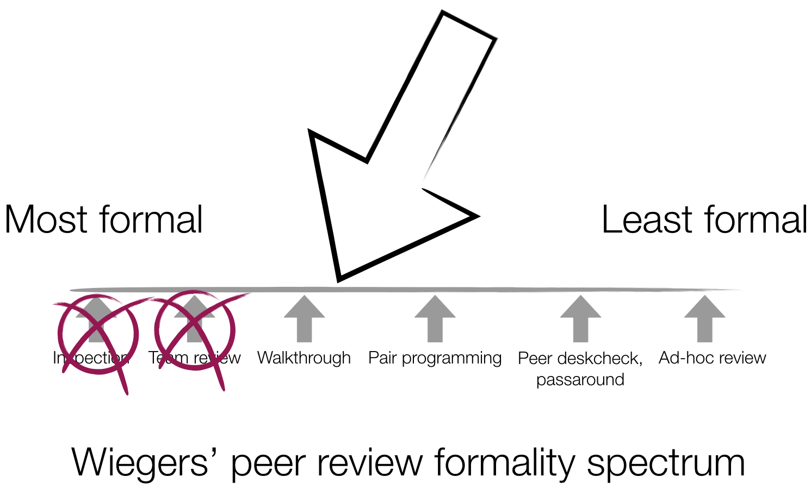
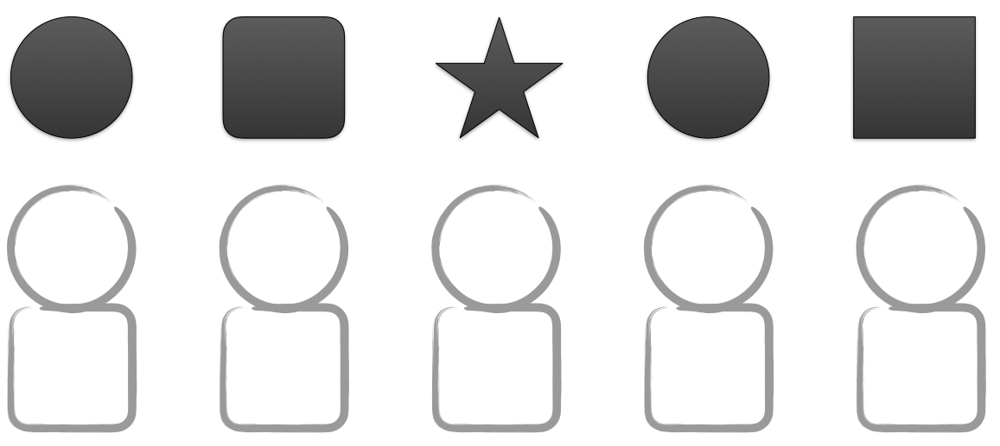
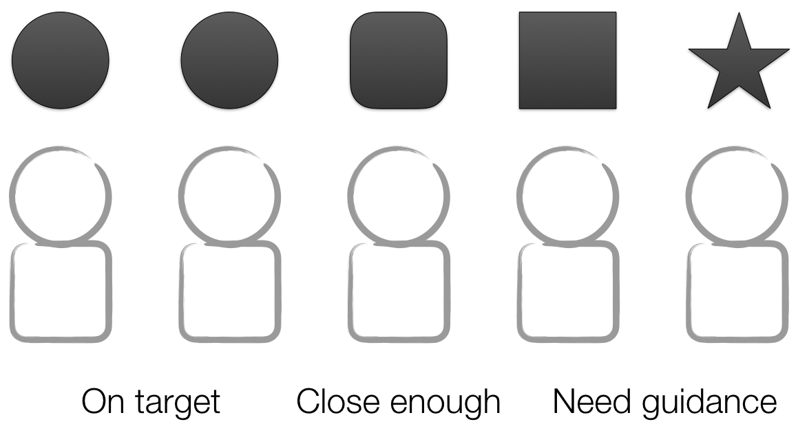
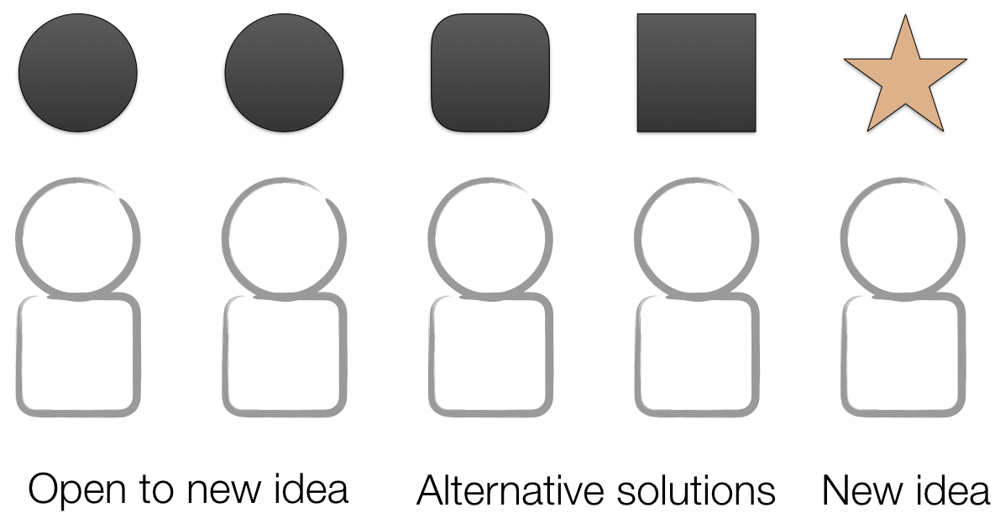
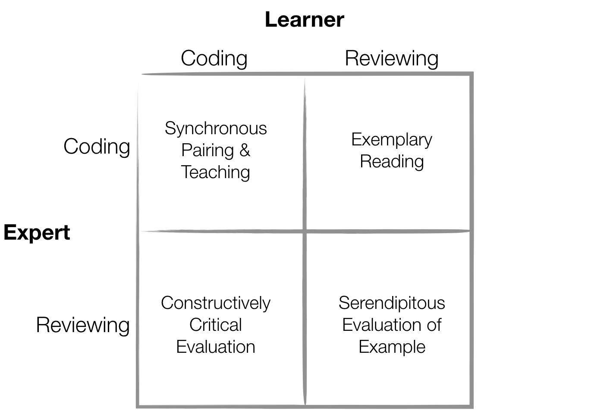
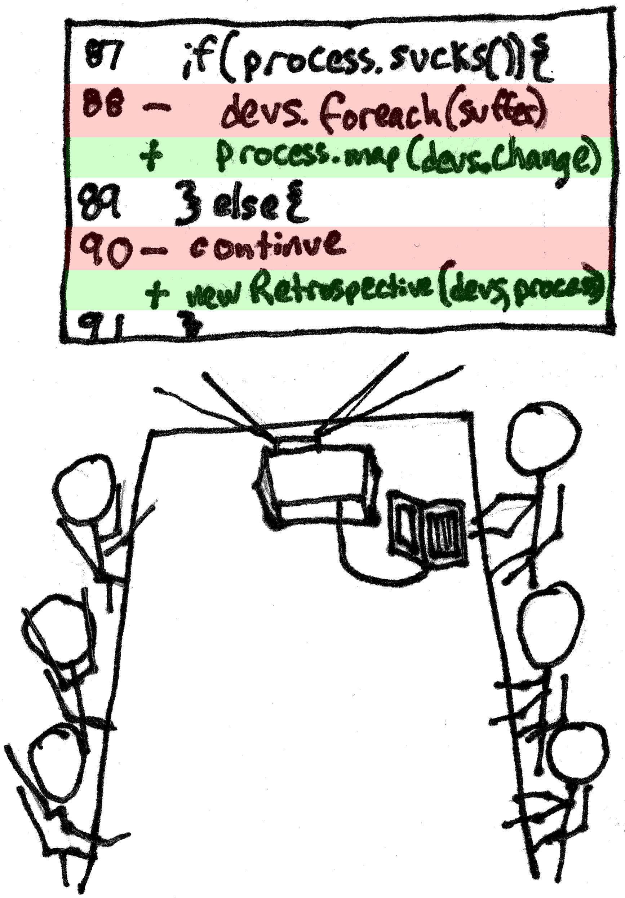
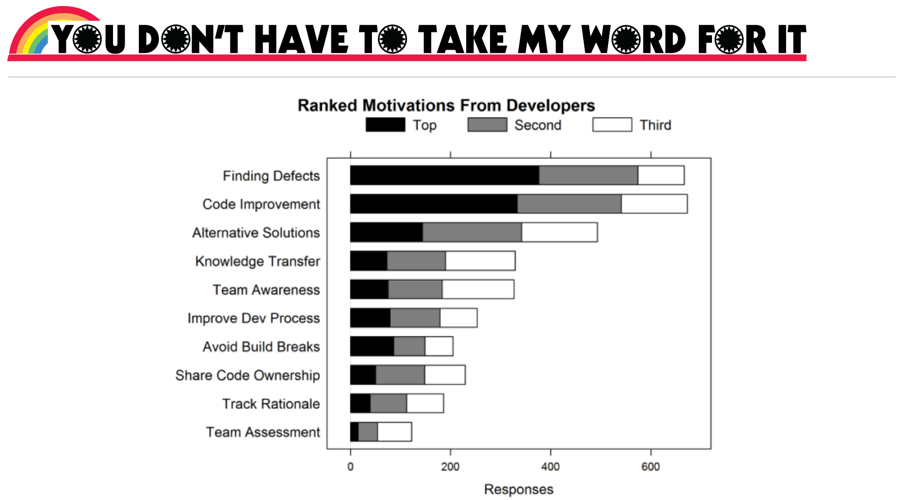

# Code Review is an Architectural Necessity

> The written version, By Colin Dean

> This series of blog posts is based on my presentation, Code Review is an Architectural Necessity. It was first presented at SATURN 2016 and subsequently at Github Universe 2016.

> This content is licensed CC3.0-BY-NC.  If would like to license this content in some way, contact me directly.

> I'd love to speak at your event! 

## My experience with review

I’ve been doing reviews and my work has been the subject of reviews since before I knew they existed in software, which is my primary field.

My first experience with review was with the student newspaper in college, first as a copyeditor. I took on layout, picked up a journalism minor, and eventually rose to be editor-in-chief, despite being a computer science major in a sea of English majors. For three and a half years, I read _everything_ that was fit to print and a whole lot more that wasn’t. Even as editor, nothing that I wrote went into the newspaper without someone else editing it, just like every other piece of content. No one was exempt from the dreaded red pen, or, in these modern days, word processors’ Record Changes feature.

That review process saved us a few times. Sometimes a student writer would just completely wreck a piece and a copyeditor was too chicken to reject it outright.  We on the layout team would have to rewrite it on the spot, hours before our print deadline. Just like versioning commit logs, we’d add our name to the byline or sometimes even replace it entirely.

When constructing our layout, we would use lots of `X` characters as easily-spotted placeholders and it wasn’t until final review before sending to pre-press that we’d catch them. One time, a headline “WHAT THE FUCK IS THIS SHIT” made it to pre-press. My prepress operator was an amazing woman with an incredible eye for errors. She was nearing retirement and probably had been working in production longer than I've been alive. She calls me up and says, “Colin, look at A-8. You owe me a beer,” and hung up. 

## What is code review?

I thought a bit and wrote how I myself define code review.

I wrote this:

> Code review is the process by which those who maintain a software codebase evaluate a proposed change to that codebase, regardless of the source of the proposed change.

Wikipedia’s definition is more succinct.

> [Code review](https://en.wikipedia.org/wiki/Code_review) is **systematic examination** of computer source code.

This definition allows for some broader techniques than those in which I myself care to participate, or suffer, but the similarity is bolded: the act is an *examination*, and that examination must be *systematic*.

You may be familiar with the term "peer review", popularized by Karl Wiegers in his work "Peer Reviews in Software." I dislike calling the process "peer reviews" as Wiegers and others do, because that puts too much focus on the *peer* whose work is under review. By calling it *code* review, we specify in our nomenclature that we are reviewing code, not a person.

Moreover, everything is code these days. Architecture and design documents can be expressed in code. You set up your systems with configuration management software, right? **Infrastructure is code** with things like Chef and AWS. A typo could be an immediate tenfold cost increase.

Throughout this series, I’ll use these five words: 

* **Change** - an individual unit of work altering what exists
* **Submission** - a collection of changes
* **Submitter** - the person proposing the submission
* **Reviewer** - the people evaluating the submission
* **Annotation** - remarks or ratings bestowed upon the submission

This sentence better captures the context of these words:

> The **submitter** proposes **changes** in a **submission**, which is evaluated by a **reviewer**, who **annotates** or accepts it.

Karl Wiegers describes this peer review formality spectrum in “Peer Reviews in Software”, where inspection is most formal and ad-hoc reviews are least formal.

My concept of code review, and my team's practice of code review, falls somewhere between “team review” and “pair programming”. 

We will from time to time allow pairs to review their own small changes at their discretion. However, our general rule is “if you wrote it, you shouldn’t review it.”

The biggest difference from Wiegers’ description is that we do not have formal meetings at this end of the spectrum. Our engineering teams have found them inefficient at best and excruciatingly painful at worst. Rather, code reviews are conducted at the reviewers’ leisure. I like to do them in the morning, personally, because it gets my brain back in code mode before I actually have to write any code for the day.

## What problems does code review solve?

The primary purpose of code reviews is to reduce defects by carefully inspecting the submitted code for problems. The goal of the reviewer is to call out identified problems so that the submitter, or anyone else, can make additional changes and resubmit for subsequent review.

Aside from the primary goal of reducing defects, code review solves two major *human* problems.

Code review solves **mental model synchronization**. Say there are five people on a team. Do they _all_ have the same mental model of the architecture and implementation?

Probably not, but hopefully they have similar understandings and concepts.

Code review reduces the feedback cycle so that people can keep their mental model in synchronization with the architecture, even as it changes. With that team-wide understanding in mind, they will be best equipped to mindfully implement the architecture and provide feedback on its design.

What if someone has a different idea entirely, one that is so worth exploring that it could change the architecture? This has happened more than once on my team, where discussions on individual lines of code turned into new issues, new pull requests, and architectural changes.

Secondly, code review solves **tribal knowledge development**. Code review is an excellent way to develop and keep alive tribal knowledge of a project. Tribal knowledge is the sum of stories of what was tried and failed, how best to handle certain problems commonly faced, and *How Things Came to Be This Way*.

A part of this is something called **architecture oral history**.

> Architecture oral history requires that the team is both willing and able to retell the stories and keep the oral history alive. - Michael Keeling, "Creating an Architecture Oral History", SATURN 2012

"Architecture oral history collapses without a team to keep the culture alive," says Keeling, a friend and fellow IBMer via Vivísimo.

Code Review, or, more specifically, code review *systems*, enable a major part of that oral history to be written down, serving as a reference point or even a starting point for documenting the change of the architecture and implementation over time. 

The most useful review systems will make comments searchable for posterity, and encourage reviewers to extract actionable items from comments into issue or work tracking systems for future consideration.

Code review doesn’t just help build knowledge of application code anymore. Code review can enable developers to continuously review changes to the infrastructure, and have an audit trail with logic and discussion around the changes. Code review can enable architects, then, to continuously review changes to the architecture, and have an audit trail with logic and discussion around those changes, too. 

Developers are included in this conversation, too, because the architecture documents should live in the same repository as the code it describes. This builds knowledge of how things changed over time and how things came to be this way.

In short, code review forces us to write down our discussions and make them searchable.

## The architectural quality attributes that code review ensures

The qualities of a system that are valued are called **quality attributes**. Architecture as a practice universally chooses from an ever-expanding set of attributes to value when building a thing. Wikipedia maintains a great list of [quality attributes](https://en.wikipedia.org/wiki/List_of_system_quality_attributes), but a quick example is the "choose any two" trichotomy of "fast, cheap, and sturdy".

The word "ensure" is used in architecture to convey that XXXXXXXXXXXXXXXXXXXXX.

### Maintainability

When the authors of a project move on, who will care for the project? People are not forever — they move to other projects or leave an organization, perhaps winning the lottery, we say. Neither are their *minds* forever — they forget what they did and why the did it after a few months, weeks, or even days — so it’s vital that an architecture values maintainability, so let’s talk about that first.

To me, valuing maintainability in an architecture necessitates that engineers write maintainable code: code that can picked up easily and quickly modified by new developers. It also has a design that is easy for non-programmers to understand. Code Review drives all of these.

#### Learnability

The best way to get someone acquainted with code is to throw them into it, not from the “go make this change” point of view, but, rather, “take a look at this real code with me”. 

We want them to learn the conventions and patterns of the codebase’s use of the language(s) and frameworks of the project. 

We want both the initial developers and the maintenance mode crew to understand the goals of the architecture, and the risks present in the code as is exists today. 

With this knowledge, they can deal with problems on their terms. We want them to use the same terminology, too: establishing that vocabulary is necessary to make the project learnable. Code review enables and encourages teaching moments, time when someone's understanding or views are challenged and possibly changed.

This chart shows the modalities for learning in a reviewing situation. Pairing is great, but we need to spend just as much time *reviewing* in order to transfer knowledge to the next generation of engineers. We need to read *solid* code and we need to read code that can be *improved*. We need to point out problems to solidify problem code and have our misunderstandings — our Type I false positive review comments — corrected by other reviewers who disagree with us.

The next generation is not only younger engineers, but also sucker taking over for you as you go to work on a cooler project.

#### Understandability

It’s vital to ensure that the developers on a project understand the architecture and the implementation decisions alike. 

While they may not be involved in construction of each decision, code review enables them to be aware of changes and ask questions about those changes as the project evolves. In doing so, they better understand architecture and implementation, and are better equipped to identify undesirable and desirable deviations from established plan and best practice. They keep their mental model in synchronization with each other and forge forward with confidence.

This builds tribal knowledge ripe for passing to others, including to executives, and to investors in the proverbial elevator.

#### Serviceability

Serviceability focuses on the ability of a technical support team to provide that support. 

By exposing new configuration, hiding unnecessary or debugging configuration, and agreeing on use cases that may fall outside of primary architectural goals, code review drives a consensus on what the people supporting the project will be expected to know and do. This also drives documentation.

> Given enough eyes, all bugs are shallow. - "Linus's Law", "The Cathedral and The Bazaar" by Eric S. Raymond

Problems are more likely to be seen if more people are looking at the source of the problem, and thinking of unintended uses and compensating behaviors.

#### Summary

So, to me, a code review ensures maintainability by encouraging engineers to write code that meets a consensus agreement on maintainability: code that modified quickly, can be picked up easily by new developers, and is easy for non-programmers to understand.

These quality attributes are all intertwined, too: systems that are serviceable are understandable, systems that are understandable are learnable.

##### A real world example from my experience

My first programming job out of school was at a business to business imprinting company. We used Subversion. It was neat. Otherwise, our engineering process was “do this thing” then "do this other thing". There was no code review process, unless you wanted someone to double check something you weren't sure of. Also “don’t break the build” was pretty easily circumvented, because our continuous integration system spent more time broken than passing. We only paired when we had hard problems we could not figure out on our own.

I didn’t have to deal with production bugs because the company didn’t want us to work outside of business hours. Rare outages were the responsibility of the tech lead, but because he wasn’t reviewing any of the code changes, outages would take a very long time to resolve because he had to learn and understand the code in order to service it.

The lack of code review in this company was a clear problem. Those outages were rare, but were caused by generally entirely avoidable, obvious errors spotted after hours of reviewing code and changes. 

A few months after I left, one guy cost the company thousands of dollars in lost sales because he’d left his own email address hardcoded for a new subsystem instead of using the proscribed environment variable. This was mistake was in place for four months. He was fired, despite this being his first and only mistake - one that could have easily been prevented by code review.

### Compliance

You have more than one person on your team knowledgeable of Section 508, WAIS, or ARIA, and internationalization and localization standards? Code review not only aids compliance by expert review, but can teach best practice, thereby expanding the number of people who can *write* code with accessibility in mind.

Code review drives auditability. You've probably heard the phrase "History is written by the victor." Well, Git history is written by the victorious commit! Version control shows what changed and the reason for the change, but it does not describe the decisions that were dropped. A code review system preserves those discussions and decisions.

The quality of using the tools chosen for the project in the best way they were designed to be used is called **idiomaticity**. Ever seen Java that looked like C? Lisp littered with lets? Java-style mutable objects everywhere in your Scala? These are violations of the idioms that these tools proscribe. Idiom violations can make for *less readable* code, and in some cases, *less performant* code: writing idiomatic code enables the compiler or interpreter produce or run faster programs.

#### Another anecdote

My second job out of school was a consulting role. I was a lone wolf consultant providing services on a niche product. The product's configuration files were notoriously difficult to version, because most of it is one massive XML file. There was no versioning built into the product, only the username of the person who last made a change to a certain area and the last modified timestamp.

The lack of control and review cost us considerable time and effort. From customers’ technical people messing up things and not owning up to it, to not having an audit trail or a second set of eyes leading to a compromised system, albeit with no evidence of exploitation, this lack hurt our relationships with our clients.

My first professional code review experience was a group meeting, a formal inspection, on subcontract for a contractor with a government client. These sessions were painful. I was the subject-matter expert in the room, trying to get my own work done while teaching the other contractors and subcontractors in the room about my product. I’d developed the tool that exported the product’s configuration file so we could even do these reviews for my part of the project. 

This team had a weekly merge window informed by a round robin inspection meeting. A _three to four hour weekly meeting_. The environment was hostile and prone to defensive stances the moment anyone lobbed criticism into the thick air. "Merge it next week" meant that you failed, and failure meant a delayed project and one more nail in the coffin for your subcontract.

By my calculation, these inefficient and negative meetings not only actively harmed the development process and the developers, but also the taxpayer: with 10 folks in the room, the meeting cost $1,450 per hour, or $5,800 per weekly meeting. That's$290,000 per year for this wasteful use of time that bred obstructionism. The primary contractor eventually lost the main contract renewal, a tens of millions of dollars level of mistake, of which this meeting was just one part.

Most of the waste could have been eliminated through a better code review process. The formality of inspections may have been a symptom rather than the problem, though, as I was not party to the discussions that mandated them. The accessibility expert was the most vocal, and rightfully so: this was a government contract and at a time when a mistake there could expose the government agency and the contractor to a lawsuit. The project manager was vocal on user experience matters. If something didn't look perfect, it could be bestowed with the dreaded "merge next week" seal of disapproval.

Both of these folks could have been enabled to perform their reviews asynchronously using a code review system and call everyone's attention to the comments, rather than occupy the time of half of a dozen people to have the same conversation.

### Security

We want to spot vulnerabilities before they ship and teach defensive posture. Linus’s Law, "Given enough eyes, all bugs are shallow" applies here, too. 

But the best way to keep out bugs and vulnerabilities in code? Simply minimize unnecessary features. YAGNI: You Ain’t Gonna Need It.

When it comes to security, reviewers are like your lawyer, screening and recommending actions to minimize risk, avoid preventable mistakes, and establish a plan for what happens when you're all wrong.

## Tips for integrating code review

### Integration in architecture planning

Conway’s Law states in paraphrase that the structure of an architecture eventually mirrors that of the developing organization, and vice versa, so it is vital that an architecture include code review as a not only a *technical* requirement at the same level as choice of language stack or inter-process communication methodology, but also as a *project* requirement that describes how the members of a project’s development team are expected to interact with each other and provide feedback in order to strengthen the project and the architecture behind it.

This is in line with a growing movement among software architects who believe that the architecture of a project must also consider human aspects and impacts, just as ethics, sustainability, and social contracts.

### Execution of code review

According to “Best Kept Secrets of Code Review”, a case study at Cisco Systems found that there was negligible difference in the number of defects found when reviewing in a formal setting versus informally, for example via the individual review methods I described earlier, while informal reviews were faster and more cost-efficient. The ideal review size should not exceed 400 changed lines of code.

* **Devote time to reviews.** Code review should occupy units of work. That is, if your team is using story points or some other system to estimate effort necessary to complete a task, estimate the time necessary to conduct reviews. My team uses a Fibonacci story point system. Most of our reviews are one or two points. If it’s a big change or potentially controversial change with a lot of input to create and process, it might be a three or five.
* **Accept debt** by accepting that not everything is perfect. A good code review system will enable reviewers or submitters to create new work items quickly and easily. 
* **Identify churn** in areas that see a lot of changes and understand why that is. There’s a whole field of study related to that, so don’t get too deep in it within the scope of reviews. 
* **Minimize pedantry** by discouraging petty annotations: keep them professional and learn when to speak. Continuing to bicker electronically is waste of time most of the time.
* Most of all, **make progress**. Don’t let reviews slow down development unnecessarily. Dogpile reviews if they get backed up.

Here is a list of things that my team acutely watches for when conducting reviews.

* Algorithmic complexity
* Exception & error handling
* Exception, class, & variable naming
* Logging sufficiency & level
* Style conformation
* Long lines & methods
* Readability
* Single purpose per commit

I must stress the value and importance of automation here. In early 2016, we automated our style checking on a new project and many of our most frequent corrections in code reviews went away: whitespace and formatting.

Of course, those, the two main questions that must be answered are these:

Does it look like it will work? Does the submission include tests?

The former is obvious: if it doesn't look like it will work, then it's not ready or the submission's description isn't clear. The latter is less obvious, but drives test-driven development. In that philosophy, the tests serve as living documentation of how to use the code. Without tests, the code is less trustworthy and accepting that submission without tests increases technical debt.

## Limitations of Code Review

Code review cannot analyze dynamic structures. It cannot really expose how code changes affect the runtime environment. A reviewer is certainly encouraged to download and execute the code as a simple verification if they feel that the provided tests are insufficient, but to do this constantly can greatly extend the review period and detract from that reviewer’s development time. Maybe one day there will be a neat tool that enables developers to interact with a change or a whole submission directly in the code review tool.

Code review cannot go on endlessly. Reviewers must learn when to communicate person-to-person instead of continuing a typewritten conversation. Drawn out electronic conversation is time consuming, and should only occur when code examples or hyperlinks are necessary to understand comments.

Most notably, code review cannot solve political problems. Code review will not magically get your boss off of you, or stop QA from knocking at your door. It won’t stop layoffs.

In fact, code review can be a barrier to one’s ownership of their contributions. A reviewer with an agenda could effectively block a submitter through combative or unnecessary annotations, or steal credit for their submission entirely through re-submission. One woman developer cited this as a part of her reason for leaving her company, later filing lawsuits alleging sexism. She held that a coworker she snubbed romantically blocked her work and would waste time altering it needlessly.

A counter to this specific problem? Ensure that no one reviewer is a bottleneck, or single point of failure, and that multiple reviewers can and do review submitters’ code.

## You don't have to take my word for it

Microsoft Research published a paper in 2013, “Expectations, Outcomes, and Challenges Of Modern Code Review”, a part of which asked developers for their motivations for performing code review, the definition of which matches very closely with what I established at the beginning of this talk.

From this, we can observe more empirically some of the outcomes from code review. All of these are desirable, thus code review should be desirable and a part of your process.

## Go forth and review code

Code review

* is **systematic examination** of proposed changes to a codebase.
* solves **mental model synchronization** and **tribal knowledge development**.
* ensures **maintainability**, **compliance**, & **security**.
* must be **short**, **thorough**, and **automated** *where possible*.
* will not solve all **human problems**, but *some* is better than *none*.

## Attributions

* Westminster College picture: https://www.flickr.com/photos/westminstercollege/15759678054/in/album-72157649340620016/
* “Their first code review” http://classicprogrammerpaintings.tumblr.com/post/142702963264/their-first-code-review-william-frederick
* Bass, Len; Paul Clements, and Rick Kazman. Software Architecture in Practice. Addison Wesley, 2013.
* Wiegers, Karl E. Peer Reviews in Software. Addison Wesley, 2012.
* Cohen, Jason, Steven Teleki, and Eric Brown. Best Kept Secrets of Peer Code Review. Smart Bear Software, 2006.
* Wilhelm, Alex and Alexia Tsotsis. Julie Ann Horvath Describes Sexism and Intimidation behind Her Github Exit. TechCruch, 2014 March 15. Retrieved 2016 April 26. http://techcrunch.com/2014/03/15/julie-ann-horvath-describes-sexism-and-intimidation-behind-her-github-exit/ 
* Baccehlli, Alberto and Christian Bird. Expectations, Outcomes, and Challenges Of Modern Code Review. Proceedings of the International Conference on Software Engineering, Proceedings of the International Conference on Software Engineering, May 2013.
