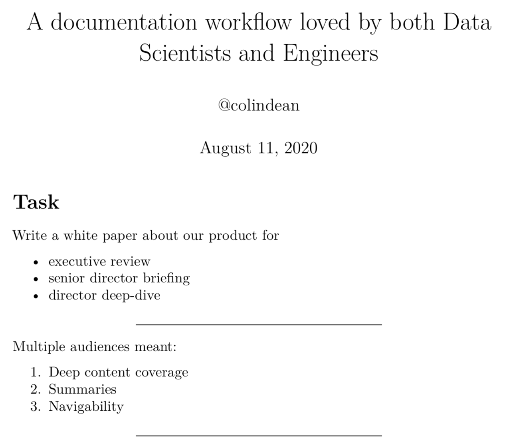

# Task

Write a white paper about our product for

* executive review
* senior director briefing
* director deep-dive

---

Multiple audiences meant:

1. Deep content coverage
2. Summaries
3. Navigability

---

## A big change

<i class="fas fa-pause"></i>

Our product development was _paused_,
so we needed to document _everything_.

It may not be our team that continues
development.

# Dramatis Personae

A team of seven colocateed data scientists and engineers

---

Lots of **engineering** detail: architecture, implementation

Lots of **mathematical** detail: equations, proofs

---

# Real need

A content-focused, scientific document authoring workflow
for Data Scientists and Engineers alike

---

# Thinking architecturally

---

# Primary Values

* Reviewable prose and diagrams
* Content-focused
* Minimize structural exceptions with standardized styling and typesetting

---

# Secondary Values

* Accomodate some preferences for LaTeX over simpler formats (Markdown)
* Easy to use: one command to generate output
* Automatable artifact built from versioned, single master copy

---

# Solution

---

# `pandoc`

---

## Biggest benefit?

LaTeX typesetting without ~~suffering~~ writing LaTeX

---

or, LaTeX when you _need it_

---

# `pandoc`, briefly

* 1.0 in 2008, 2.0 in 2017, 2.9.x in 2019
* Open source, GPL-2.0-or-later
* Written in Haskell with a Lua scripting engine
* 33 input formats, dozens of output formats

---

# `pandoc` HOWTO

---

## Install

```shell
brew  install pandoc  # macOS with Homebrew
apt   install pandoc  # Debian/Ubuntu/Pop_OS
scoop install pandoc  # Windows with Scoop
crew  install pandoc  # Chrome OS with chromebrew
```
---

## Invocation

```shell
pandoc document.md -o document.pdf
```

---



---

## Real Invocation

```shell
pandoc \
  01_intro.md 02_problem.md 03_diagnosis.md \
  04_remedy.md 05_summary.md \
  --output documentation.pdf \
  --filter pandoc-crossref \
  --filter pandoc-citeproc \
  --lua-filter .filters/glossary/pandoc-gls.lua \
  --pdf-engine xelatex \
  --top-level-division=chapter \
  --number-sections \
  --toc --toc-depth=3 \
  -M lof -M lot \
  --bibliography=bibliography.bib \
  …
```

::: notes
Break down chapters and sections into separate files. Pandoc concatenates input.

Note the use of filters, the choice of PDF engine
that enables XeLaTeX in order to use Unicode and some other implementation-specific features.

Note the choices about table of contents, section numbering, lists of figures and tables, and bibliography.

:::
---

Most CLI options can be put into the YAML front-matter of the document.

---

```yaml
---
title: >
  A documentation workflow loved
  by both Data Scientists and Engineers
author: '@colindean'
date: August 11, 2020
theme: white
css: custom.css
---

# Task

Write a white paper about our product for

* executive review
* senior director briefing
* director deep-dive

```
---

## This presentation is written in Markdown

and converted to a Reveal.js presentation:

```makefile
PRESENTATION = document_workflow
MARKDOWN = $(PRESENTATION).md
HTML = $(PRESENTATION).html
DEPS_DIR = deps
all: $(HTML)

%.html: %.md
  pandoc \
    --to=revealjs --standalone \
    $< --output=$@ \
    -M revealjs-url=$(DEPS_DIR)/reveal.js/reveal.js-3.9.2
```
::: notes
Reveal and Powerpoint are supported first-class for output
:::
---

## Build system versus a script

* Make
* Gradle

::: notes
Any sufficiently advanced build script eventually reimplements Make.
:::

---

## Common plugins

|Plugin|Purpose|
|------|-------|
|`pandoc-citeproc`|Processes citations, enables BibTeX use|
|`pandoc-crossref`|Enables cross-referencing for figures, equations, sections, etc.|
|`code-includes`  |Includes code from files instead of embedding|

::: notes
We've used citeproc and crossref extensively.
:::

---

## More plugins

Plugins written in Haskell, Lua, Python, and more

Loads more: https://github.com/jgm/pandoc/wiki/Pandoc-Filters

::: notes
Strongly recommend using Lua, which doesn't require
installing or compiling anything additional.
:::

---

# Pain Points

---

## Pain getting started

* Dependency installation
* Learning Pandoc's flavor of Markdown
* "Why can't I just use LaTeX?"
* Converting from Word or LaTeX loses cross-references˚

<small><em>˚as of Pandoc 2.9.x</em></small>

---

## Productivity Pain points

* Incomplete WYSIWYG
* Bugs in workflow, sole developer stakeholder
* Equation writing workflow disjointed
  * Editor with TeX equations support
  * Separate renderer (LaTeXiT, MathJax.com)
  * Just render it

---

## Accomodating objections

* I want to use X
  * "But I want to use LaTeX"
    * only if you'll own that file!
  * "But I want to write my section in X and export it to Pandoc Markdown"
    * only if you can effect changes suggested in the PR

---

## Greatest risk of additional transformation tools?

---

### Overwriting.

Changes made to a file in the repo being overwritten by the output of an external tool's cost us _a lot_ of time.

---

# Feedback

_You don't have to take my word for it!_

---

## Positive

> "Leveled the playing field for contributions, great for collaborating and building documents with all of the features of LaTeX"

<small><em>\- PhD who loves LaTeX</em></small>

---

## Negative

> "I miss having fine-level control of figures, subfigures, positioning, etc."
