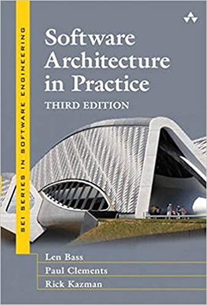
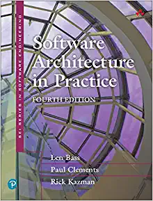
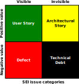

---
####
## NOTA BENE:
## :::Notes are not shown on slides, only on presenter view.
####
title: >
  Meaningful ticket labeling
  with SEI classification
author: '@colindean'
date: December 20, 2021
theme: white
css: custom.css
slideNumber: true
hash: true
history: true
transition: none
transitionSpeed: "fast"
totalTime: 1800
---

# I am Colin Dean

Software Engineer & Community Builder

::: notes

Hi, I'm Colin. I'm a software engineer for a retail company that seems like it
might sell archery sporting goods but the only archery-related products we sell
are children's toys.

I also run this here community, Code & Supply, and you may have heard of a
non-profit WiFi ISP I helped to start called Meta Mesh Wireless Communities.

:::

---

# Classification

Label your tickets

_(in JIRA, GitHub Issues, etc.)_

::: notes

I'm going to talk about classifying work tickets.
You know, those things you're supposed to file and update between planning
meetings...?

:::

---

# SEI

Software Engineering Institute

at

Carnegie Mellon University

::: notes

There's this really cool organization at CMU called the Software Engineering
Institute.

:::

---

<!-- swap after May 2022 -->
<!---->

by Bass, Clements, Kazman

ISBN-13: 978-0321815736

::: notes

These folks published a book called _Software Architecture in Practice_ many
years ago. A then-coworker and Code & Supply member Michael Keeling introduced
me and others to this book and I went all-in on it.

:::

---

# Quadrants

::: notes

One big takeaway on this was this diagram.
I decided to classify my project's tickets according to this diagram.
It's been wonderful across three companies and several teams.

:::

---

## User Story

Positive value & User visible

---

### User Story examples

* Modify user interface
* Modify model algorithm
* Conduct user research

---

## Architectural Story

Positive value & User invisible

---

### Arch. Story examples

* Build backend service or pipeline
* Implement new algorithm

_(best practices as of implementation)_

---

## Defect

Negative value & User visible

---

### Defect examples

* Current behavior produces result developer didn't expect
* Fix environment outage
* Fix security problems

---

## Technical Debt

Negative value & User invisible

---

### Tech. Debt examples

* Improve performance
* Update dependencies
* Automate a manual process

_(moving toward best practices)_

---

{height=30%}\

> Collecting the corners cut in a jar to reattach them later

::: notes

One team member who's been around the industry for decades
said it was like collecting the corners we cut during development
into a jar so we can pull them out and reattach them later on.

:::

---

# Tracking

Create colored labels:

<code style="background-color: green; color: white;border-radius: 5px">user-story</code>,
<code style="background-color: yellow;border-radius: 5px">arch-story</code>,
<code style="background-color: red;border-radius: 5px">defect</code>,
<code style="background-color: black; color:white; border-radius: 5px">techdebt</code>,

Require at least one of them.

---

# Optional additional classification

::: notes

I've got back and forth on these, and usually end up enacting at least one of these for
when something doesn't quite fit well within these four quadrants.

:::

---

## Documentation

* Documenting team procedures
* Writing post-mortems about outages, etc.

Beware: product documentation falls into the four quadrants categories!

---

## Discussion or Question

* Decision meetings
* Keeping debates in ticketing
* Separating work product from the process used to determine what work to do

---

### Architecture Decision Records

* Context
* Decision
* Status
* Consequences

<https://cognitect.com/blog/2011/11/15/documenting-architecture-decisions>

<https://github.com/npryce/adr-tools>

---

ADRs are a product, too…

…and probably techdebt or archstory

---

# Consuming the classification

---

## Use reports or saved searches

* Lots of red = work on defects first
* Lots of black = pay down debt or prune backlog for outdated ideas
* Lots of yellow = measure value of backend improvements
* Lots of green = users may need to experience changes

---

# TL;DR

Label your tickets/issues

<code style="background-color: green; color: white;border-radius: 5px">user-story</code>,
<code style="background-color: yellow;border-radius: 5px">arch-story</code>,
<code style="background-color: red;border-radius: 5px">defect</code>,
<code style="background-color: black; color:white; border-radius: 5px">techdebt</code>,

Colorize to make them standout

Documentation is a part of the product

Decisions should produce documentation, too
